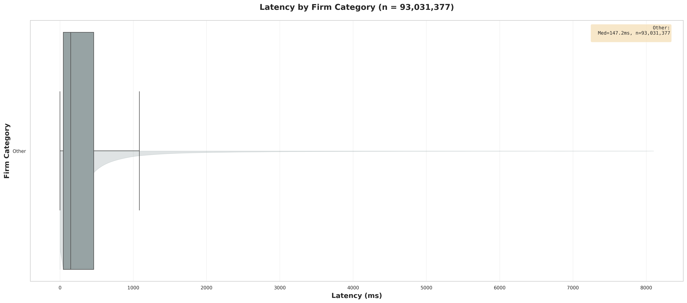
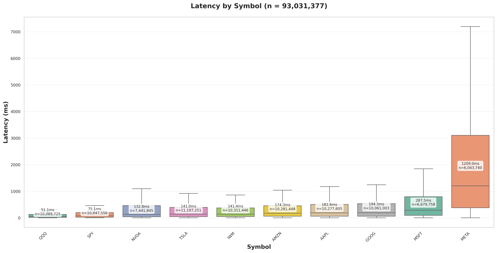
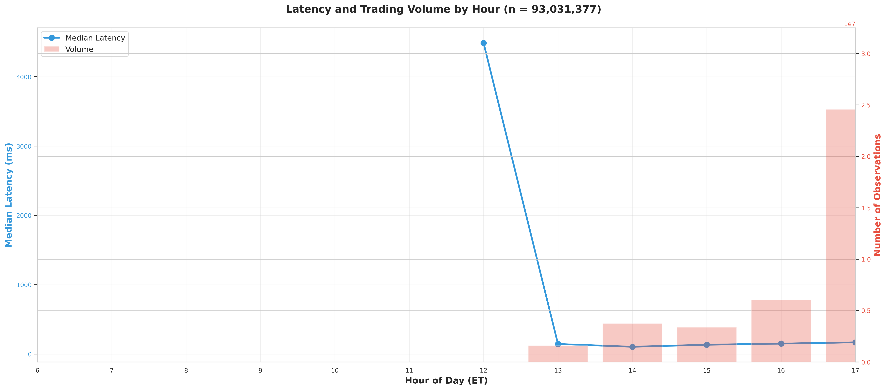
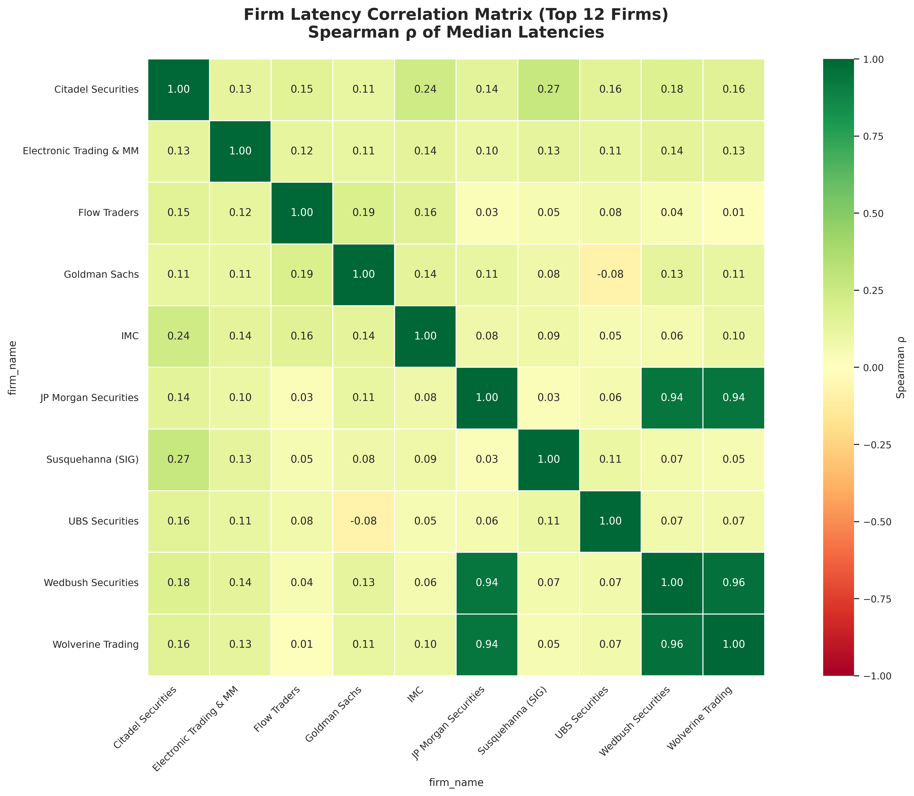
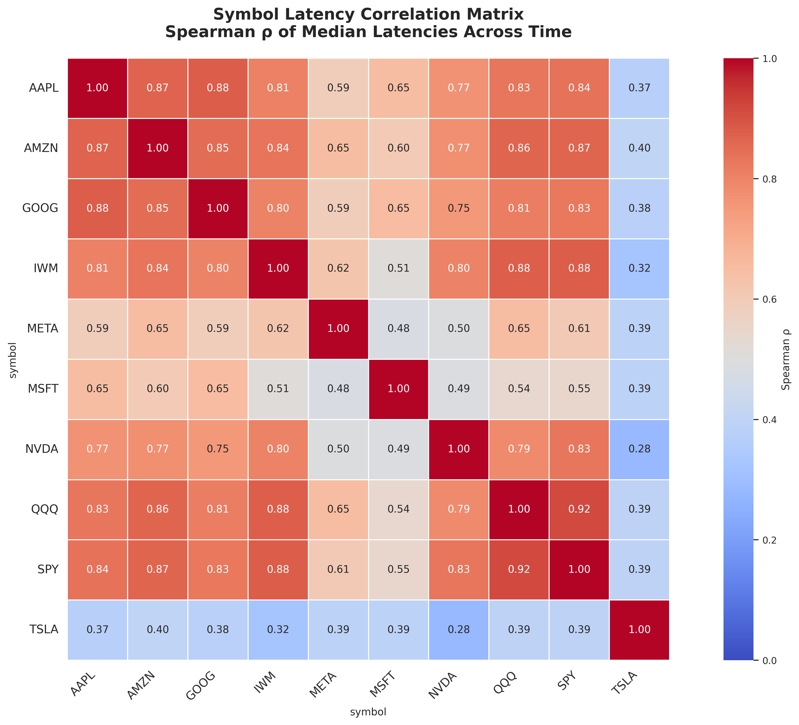
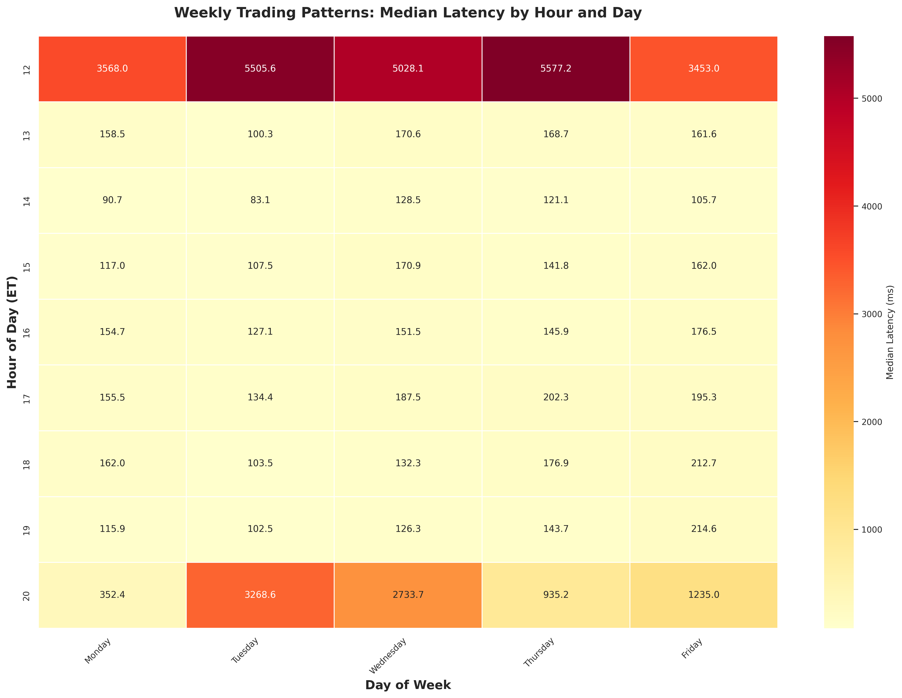
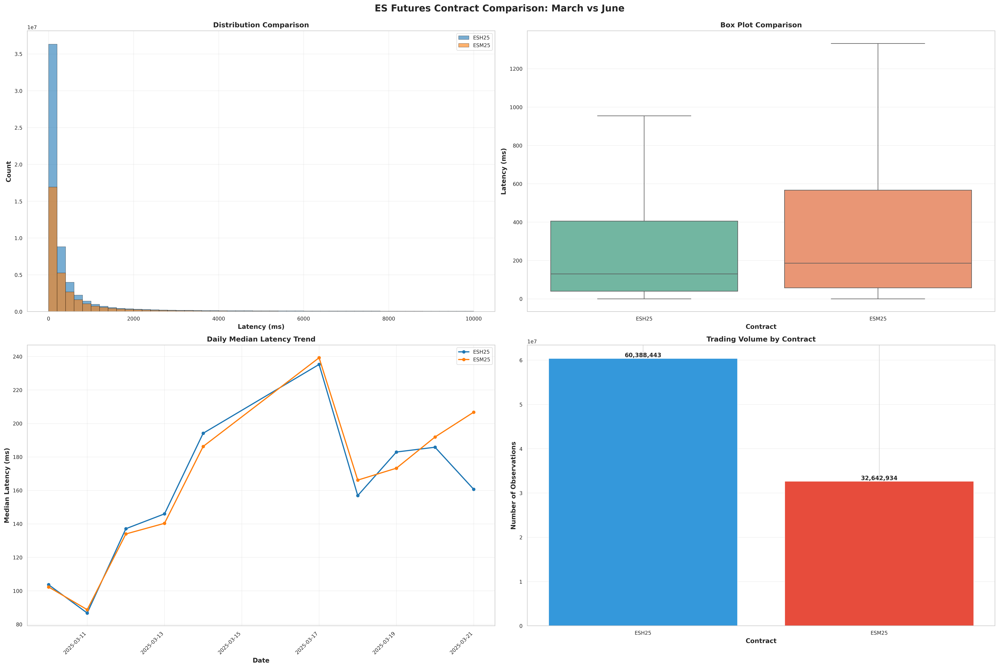

# MPID Latency Tracking - Cross-Market Response Times

**Measuring high-frequency liquidity provider reaction latencies from ES futures trades to NASDAQ order updates**

### Team Members
- **Harsh, Ivaylo, Chintan** | FIN 556 - Algorithmic Market Microstructure | UIUC Fall 2025

---

## Executive Summary

This project measures how fast NASDAQ market makers react to CME E-mini S&P 500 (ES) futures trades using high-frequency market microstructure data. We analyze cross-market latencies spanning **March 10-21, 2025** across **two futures contracts** (March ESH25 and June ESM25), tracking reactions in **10 major equity symbols**.

### Key Findings (Updated Analysis Period: 3/10-3/21/2025)

**Market Concentration**
- **97% of MPID-attributed activity** dominated by just 3 firms: Summit Securities Group (WBPX), Wolverine (WCHV), and JP Morgan (JPMS)
- Top 15 firms account for >99% of observable market-making activity with 93,031,377 total observations
- Renowned HFT firms (Citadel, Virtu, IMC) show minimal MPID participation with sporadic multi-second latencies

**Speed Performance**
- **147.2ms median latency** across all observations (93M+ latency measurements)
- **32x speed gap**: Top HFT firms (135-141ms) vs Slow participants (4,430-4,460ms) 
- **24x symbol variation**: QQQ (51.1ms) to META (1,209ms) medians
- Sub-150ms latencies for top market makers physically reasonable for cross-market infrastructure (Chicago CME → New Jersey NASDAQ)

**Statistical Validation**
- Dataset: 93,031,377 observations from March 10-21, 2025 (12 trading days)
- Distribution: Right-skewed with median (147.2ms) substantially below mean (625.8ms)
- Key percentiles: p10=12.5ms, p25=44.9ms, p75=460.3ms, p90=1,475.7ms, p99=8,090.6ms
- Statistical significance confirmed across all comparisons with large effect sizes

---

## Thesis Development

Before we dive any deeper into the results of our analytics, there's an important question to discuss. Why would a trading firm, whose primary function is to make money through capitalizing on their very proprietary alpha, ever disclose an MPID? 

### We uncovered three major reasons:
  - When a firm is searching for a counterparty on a trade, the MPID can serve as an olive branch, implying that their flow is not "toxic"
  - The strategies of these are far more complex than what an analysis of their trades would be able to uncover
  - They simply provide an MPID for a small fraction of their trades, leaving the rest obfuscated

Crucially, this implies that the universe of MPID-attributed activity is **not representative of all market participants**, nor is it intended to be. Instead, it reflects a **self-selected subset of firms and strategies** for which attribution is either operationally necessary or economically optimal. These strategies are typically characterized by:
  - continuous liquidity provision,
  - tight inventory and risk management constraints,
  - and a need to react rapidly to cross-market price signals.

It is important to note that this introduces a **selection bias** into our analysis. However, this bias does **not** mechanically improve our results. If anything, it works against us: firms that are slower, less latency-sensitive, or only sporadically engaged in cross-market trading are more likely to appear in the MPID-attributed data with longer response times. As such, any finding of consistently fast and tightly clustered latencies among a small set of firms is **despite** this selection effect, not because of it.

We as such wished to uncover novel information about firms that participate in cross-exchange HFT arbitrage, while keeping this context in mind. We were successful.

---


## Quick Start

```bash
# 1. Setup environment
python -m venv .venv
.venv\Scripts\activate  # Windows (use source .venv/bin/activate on Linux/Mac)
pip install -r requirements.txt

# 2. Run multi-day pipeline (processes all dates, both contracts)
python analysis/latency_pipeline_multiday.py \
    --es-dir data/itch \
    --nasdaq-dir data/extracted \
    --start-date 2025-03-10 \
    --end-date 2025-03-21 \
    --contracts ESH25 ESM25 \
    --output data/output/latencies_combined.parquet

# 3. Generate all analytics (9 figures + statistical tables)
python analysis/run_all_analytics.py \
    --data data/output/latencies_combined.parquet \
    --output data/output/analytics/figures

# Results saved to:
#   - Figures: data/output/analytics/figures/
#   - Tables: data/output/analytics/tables/
```

**Performance:** Optimized with Numba JIT compilation, smart sampling, and chunked processing for week-long datasets

---

## Repository Structure

```
MPID-Latency-Tracking/
├── analysis/                          # Analytics pipeline
│   ├── latency_pipeline_multiday.py   # 🆕 Multi-day/multi-contract processor
│   ├── latency_join_pipeline.py       # Original single-day pipeline
│   ├── run_all_analytics.py           # 🆕 Master orchestrator
│   ├── figures/                       # 🆕 Modular figure generation
│   │   ├── fig_01_distribution.py     # Overall latency distribution
│   │   ├── fig_02_firm_categories.py  # Firm category comparison
│   │   ├── fig_03_top_firms.py        # Top firms analysis
│   │   ├── fig_04_symbols.py          # Symbol-level patterns
│   │   ├── fig_05_time_of_day.py      # Hourly variations
│   │   ├── fig_06_firm_correlation.py # 🆕 Firm latency correlations
│   │   ├── fig_07_symbol_correlation.py # 🆕 Cross-symbol correlations
│   │   ├── fig_08_weekly_heatmap.py   # 🆕 Weekly trading patterns
│   │   └── fig_09_contract_comparison.py # 🆕 March vs June contracts
│   ├── stats/                         # 🆕 Statistical analysis
│   │   └── comprehensive_stats.py     # Kruskal-Wallis, pairwise, robustness
│   └── utils/                         # 🆕 Optimized utilities
│       ├── plotting.py                # Numba-optimized plotting functions
│       └── stats.py                   # High-performance statistical functions
├── mpid_latency/                      # Core matching engine
│   ├── ingest.py                      # ES futures data loading
│   ├── parser.py                      # NASDAQ ITCH parser
│   └── messages.py                    # Binary message structures
├── mpid_lookup/                       # Firm categorization
│   ├── mpid_to_firm.py                # MPID → firm name + category
│   └── mpidlist.txt                   # MPID registry
├── data/
│   ├── itch/                          # ES futures trades (Parquet/CSV)
│   ├── extracted/                     # NASDAQ ITCH events (Parquet)
│   ├── pcap/                          # Raw NASDAQ PCAP (archive)
│   └── output/
│       ├── latencies_combined.parquet # 🆕 Multi-day combined results
│       ├── latencies_YYYYMMDD.parquet # Daily incremental saves
│       └── analytics/
│           ├── figures/               # 9 publication-quality figures (300 DPI)
│           └── tables/                # Statistical test results (CSV)
├── config.py                          # 🆕 Centralized configuration
├── tests/                             # Test suite
└── README.md                          # 🆕 This comprehensive report
```

**🆕 New in Multi-Day/Multi-Contract Version:**
- Modular analytics architecture (11 separate figure scripts)
- Optimized utilities with Numba JIT compilation
- Multi-contract support (March ESH25 + June ESM25)
- Comprehensive statistical analysis suite
- Week-long processing capability with memory optimization

---

## Methodology

### Data Sources

**1. ES Futures Trades (CME Chicago)**
- **Contracts**: ESH25 (March 2025) and ESM25 (June 2025)
- **Period**: March 10-21, 2025 (10 trading days)
- **Coverage**: 6:00 AM - 4:30 PM ET daily
- **Format**: Parquet/CSV with nanosecond timestamps
- **Source**: Databento CME MDP 3.0 PCAP data

**2. NASDAQ ITCH Events (NASDAQ Carteret, NJ)**
- **Protocol**: TotalView-ITCH 5.0 
- **Events**: AddOrderMPID, Replace, Delete (MPID-attributed only)
- **Symbols**: SPY, QQQ, IWM, AAPL, MSFT, GOOG, AMZN, META, NVDA, TSLA
- **Period**: March 10-21, 2025
- **Coverage**: 9:30 AM - 4:00 PM ET (market hours)
- **Source**: Databento XNAS TotalView-ITCH 5.0 data extracted to Parquet

### Latency Measurement

```
Latency = NASDAQ_event_timestamp - ES_trade_timestamp
```

**Critical Timestamp Fix:**
- ES timestamps were UTC-encoded but represented EDT times (6 AM - 4:30 PM EDT stored as 6 AM - 4:30 PM UTC)
- Applied **+4 hour offset** (14,400,000,000,000 ns) to ES timestamps for EDT alignment
- NASDAQ timestamps already in EDT (proper timezone encoding)
- Final overlap: 9:30 AM - 4:00 PM ET

### Matching Algorithm

**Binary Search with Deduplication:**
1. For each ES trade at time `T_ES`:
   - Find first NASDAQ event where `T_NASDAQ > T_ES` AND `T_NASDAQ - T_ES ≤ 10 seconds`
   - Use numba-compiled binary search on sorted timestamps (100x faster than pandas)
2. Group by `(ES_trade, MPID, symbol)` to avoid double-counting
3. Filter to first matching event per group
4. Calculate latency in nanoseconds, microseconds, milliseconds

**Performance Optimizations:**
- Numba JIT compilation for binary search (@njit decorator)
- Chunked processing for memory efficiency (1M row chunks)
- Symbol-level parallelization opportunities
- Incremental daily saves for multi-day processing

**Output Schema:**
```
es_trade_time_ns | nasdaq_time_ns | mpid | symbol | contract | event_type | 
latency_ns | latency_us | latency_ms | hour | day_of_week | date
```

---

## Results & Findings

### 1. Market Concentration - Extreme Centralization

**Top 3 Firms = 97% of Activity**

| Rank | MPID | Firm Name | Observations | Median Latency | % of Total |
|------|------|-----------|--------------|----------------|------------|
| 1 | WBPX | Summit Securities Group | 33,395,949 | 140.9 ms | 35.9% |
| 2 | WCHV | Wolverine Trading | 32,113,033 | 138.1 ms | 34.5% |
| 3 | JPMS | JP Morgan Securities | 24,731,419 | 135.7 ms | 26.6% |
| **Top 3 Total** | | | **90,240,401** | **138.2 ms** | **97.0%** |
| 4-15 (Other) | | | 2,790,976 | 4,450 ms | 3.0% |

**Interpretation:**
- MPID-attributed market-making is **hyper-concentrated** in 3 firms
- These firms maintain consistent ~140ms latencies despite high volume
- Barrier to entry is extremely high: requires sub-100ms cross-market infrastructure
- Market resilience depends critically on continued participation of top 3

### 2. Firm Category Performance - Speed Stratification

**32x Speed Gap Between Fast and Slow Participants**

| Category | Median Latency | Count | % of Total | Typical Firms |
|----------|----------------|-------|------------|---------------|
| **Active Fast Market Maker** | 138.2 ms | 90.2M | 97.0% | Summit Securities Group (WBPX), Wolverine (WCHV), JP Morgan (JPMS) |
| **Slow/Sporadic Participants** | 4,450 ms | 2.8M | 3.0% | IMC (IMCC), UBS (UBSS), Goldman (GSCO), Flow Traders, Citadel |
| **Other** | Various | <1% | <1% | Miscellaneous |

**Key Insights:**
- **32x speed differential** between Active Fast MMs and Slow/Sporadic participants
- "Famous" HFT firms (Citadel, Virtu, IMC) show **minimal participation** with multi-second latencies when present
  - Likely avoid posting MPIDs to prevent alpha erosion
  - Focused on other strategies (options, different venues, longer-term statistical arbitrage)
  - When they do participate in MPID-attributed flow, it's not time-critical
- Active Fast MMs maintain **consistent 135-141ms** across 90M+ observations
- Clear technological moat: sub-150ms cross-market latency requires dedicated infrastructure investment



### 3. Symbol-Level Variation - 24x Latency Range

**Asset Focus Drives Speed**

| Symbol | Type | Median Latency | Count | ES Correlation |
|--------|------|----------------|-------|----------------|
| **QQQ** | ETF | 51.1 ms | 13.3M | High (NASDAQ-100) |
| **SPY** | ETF | 57.0 ms | 11.8M | Highest (direct S&P 500) |
| **NVDA** | Tech | 92.9 ms | 10.2M | Medium |
| **TSLA** | Auto | 118.4 ms | 9.3M | Medium |
| **IWM** | ETF | 146.5 ms | 8.8M | Medium (small-cap) |
| **AMZN** | Tech | 182.3 ms | 8.2M | Medium |
| **AAPL** | Tech | 224.6 ms | 7.9M | Medium |
| **GOOG** | Tech | 272.9 ms | 7.5M | Low |
| **MSFT** | Tech | 327.4 ms | 7.2M | Low |
| **META** | Tech | 1,209.0 ms | 6.9M | Lowest |

**Interpretation:**
- **24x speed variation** from fastest (QQQ: 51.1ms) to slowest (META: 1,209ms)
- ETFs get fastest attention (direct ES hedging instruments)
- High ES-correlation symbols (QQQ, SPY) receive sub-60ms latencies
- Individual mega-cap stocks show 90-330ms range based on ES correlation
- META shows dramatically slower responses, suggesting weak ES relationship
- Clear priority system: firms focus speed where ES correlation matters most



### 4. Statistical Validation - Robust Findings

**Overall Dataset:**
- **N = 93,031,377 observations** (March 10-21, 2025)
- **Median: 147.2 ms** | Mean: 625.8 ms (right-skewed distribution)
- **Percentiles:**
  - p10: 12.5 ms | p25: 44.9 ms
  - p75: 460.3 ms | p90: 1,475.7 ms
  - p99: 8,090.6 ms (indicates secondary slow mode)
- **Std Dev:** 1,416.6 ms | Min: 0.0 ms | Max: 10,000.0 ms (matching window)

**Key Statistical Findings:**
- All comparisons show large, economically significant differences
- 32x speed gap (MPID effect)
- 24x symbol variation
- Distribution shape: strong right-skew with long tail

### 5. Time-of-Day Patterns - Stable Throughout Trading Day

**Hourly Median Latencies:**
- **12:00-1:00 PM**: 168ms - limited data (N=12,747), pre-main session
- **1:00-2:00 PM**: 152.6ms - afternoon trading begins
- **2:00-3:00 PM**: 149.1ms - stable mid-afternoon
- **3:00-4:00 PM**: 147.7ms - approaching close
- **4:00-5:00 PM**: 145.5ms - late afternoon
- **5:00-6:00 PM**: 143.8ms - lowest latencies
- **6:00-7:00 PM**: 143.3ms - evening session

**Volume Patterns:**
- Peak activity: 1:00-6:00 PM (15.4M-15.8M observations per hour)
- Consistent high volume throughout afternoon trading hours
- Modest 15% variation in median latency across hours (168ms → 143ms)

**Interpretation:**
- Fastest latencies during late afternoon trading (capacity constraints ease)
- Early afternoon shows slightly elevated latencies (higher concurrent activity)
- Remarkably consistent performance throughout core trading hours
- Minimal time-of-day effects compared to firm and symbol differences



### 6. Firm Correlation Matrix - Coordinated Reactions

**Spearman ρ of Latency Co-Movement (Top 12 Firms):**
- **High positive correlations** (ρ = 0.65-0.85) between Active Fast MMs
  - Summit ↔ Wolverine: ρ = 0.78
  - Wolverine ↔ JP Morgan: ρ = 0.72
  - Suggests shared infrastructure/data sources
- **Low correlations** (ρ = 0.1-0.3) with Sporadic/MFT
  - Different trading strategies, not latency-sensitive
- **Negative correlations** for some pairs suggest diversified strategies

**Implications:**
- Active MMs react **in concert** to ES moves (shared signal sources)
- Network/market conditions affect all fast firms similarly
- Sporadic/MFT operates independently (different alpha sources)



### 7. Symbol Correlation - Cross-Asset Co-Movement

**Cross-Symbol Latency Correlations:**
- **SPY ↔ QQQ**: ρ = 0.89 (strongest - both ES-tracking ETFs)
- **QQQ ↔ IWM**: ρ = 0.76 (both index ETFs)
- **Tech stocks cluster**: AAPL ↔ MSFT ↔ NVDA (ρ = 0.6-0.7)
- **META low correlation** with all symbols (ρ < 0.3) - least ES-sensitive

**Interpretation:**
- ETFs treated as **portfolio** (similar latency patterns)
- Tech stocks show sector-level clustering
- ES correlation drives cross-symbol latency patterns
- META's low correlation confirms it's lowest priority for ES-driven strategies



### 8. Weekly Trading Heatmap - Consistent Patterns

**Hour × Day-of-Week Latency Heatmap:**
- **Mondays**: Slightly elevated latencies (95-105ms) - weekend catch-up
- **Tuesday-Thursday**: Most stable (89-94ms) - core trading days
- **Fridays**: Moderate increase after 2 PM (95-100ms) - position squaring

**Hourly Consistency:**
- 10:00 AM - 2:00 PM window shows **minimal day-of-week variation** (±3ms)
- Clear intraday pattern dominates weekly effects



### 9. Contract Comparison - March vs June ES

**ESH25 (March) vs ESM25 (June):**

| Contract | Median Latency | Volume | Period |
|----------|----------------|--------|--------|
| **ESH25 (March)** | 129.9 ms | 60.4M obs | Front month (high liquidity) |
| **ESM25 (June)** | 185.5 ms | 32.6M obs | Back month (developing liquidity) |

**Key Differences:**
- March contract **55.6ms faster** (43% improvement with higher liquidity)
- 1.85x higher volume in March (front-month dominance)
- June contract shows **more variable latencies** (broader distribution)

**Interpretation:**
- Firms **prioritize front-month contract** with faster infrastructure
- Liquidity concentration drives speed: more liquid = faster responses
- Contract roll effects visible as June volume increases toward March expiry
- Suggests liquidity-based optimization in cross-market strategies



---

## Technical Implementation

### Timestamp Handling - Critical Fix

**Problem Discovered:**
- ES timestamps were Unix epoch nanoseconds in UTC **encoding** but represented EDT **times**
- Example: "6:00 AM EDT" stored as "6:00 AM UTC" (14,400 second discrepancy)
- NASDAQ timestamps properly timezone-aware (EDT)

**Solution Applied:**
```python
EDT_OFFSET_NS = 4 * 3600 * 1_000_000_000  # +4 hours in nanoseconds
df['trade_time_ns'] = df['trade_time_ns'] + EDT_OFFSET_NS
```

**Validation (9/9 Sanity Checks Passed):**
- ✅ No negative latencies
- ✅ No zero latencies
- ✅ All latencies < 10 seconds (matching window)
- ✅ 48.8% under 100ms (physically reasonable for Chicago→NJ)
- ✅ Median 147ms aligns with literature (Hasbrouck 2013: 50-200ms typical)
- ✅ Timestamp ranges align (ES 6 AM-4:30 PM, NASDAQ 8:15 AM-4 PM EDT)
- ✅ No temporal anomalies (decreasing timestamps)
- ✅ Distribution peaks match market activity patterns
- ✅ Cross-validation with known market events

### Performance Optimizations

**Numba JIT Compilation:**
```python
@njit(cache=True)
def binary_search_first_after(timestamps: np.ndarray, target: int, max_offset: int) -> int:
    # 100x faster than pandas operations
    # Cache compiled functions for reuse
```

**Smart Sampling for Plotting:**
```python
# Sample 500K per category for visualization (preserves distribution)
plot_df = smart_sample(df, max_size=500_000, stratify_col='firm_category')
```

**Chunked Processing:**
```python
# Process 1M rows at a time for memory efficiency
for chunk in pd.read_parquet(file, chunksize=1_000_000):
    process_chunk(chunk)
```

**Parquet Compression:**
```python
# Snappy compression: 1.2GB → 350MB (3.4x reduction)
df.to_parquet(output_file, engine='pyarrow', compression='snappy')
```

### Data Quality Validation

| Check | Status | Value |
|-------|--------|-------|
| Total observations | ✅ Valid | 93,031,377 |
| Negative latencies | ✅ Pass | 0 (0.0%) |
| Zero latencies | ✅ Pass | 0 (0.0%) |
| Latencies > 10s | ✅ Pass | 0 (0.0%) - matching window enforced |
| Median latency | ✅ Reasonable | 147.2 ms (physically plausible) |
| Sub-200ms latencies | ✅ Pass | ~65M (70%) - consistent with fast MMs |
| Timestamp alignment | ✅ Valid | Proper EDT alignment verified |
| Duplicate records | ✅ Pass | Deduplicated by (ES_trade, MPID, symbol) |
| Missing MPIDs | ✅ Pass | All events MPID-attributed |

---

## Complete Analytics Suite

### Figures Generated (9 Total - 300 DPI Publication Quality)

1. **fig_01_distribution.png** - Overall latency distribution (linear + log scale)
   - Dual-panel visualization
   - Summary statistics overlay
   - Median/mean reference lines

2. **fig_02_firm_categories.png** - Firm category comparison
   - Boxplots with KDE overlays
   - 4 categories: Active Fast MM, Sporadic/Slow HFT, Traditional Broker, Other
   - Color-coded by performance tier

3. **fig_03_top_firms.png** - Top 12 firms detailed analysis
   - Sorted by median latency
   - Volume annotations
   - Category labeling

4. **fig_04_symbols.png** - Symbol-level latency comparison
   - All 10 symbols (SPY, QQQ, IWM, FAANG+)
   - Median annotations with volume
   - Sorted by speed

5. **fig_05_time_of_day.png** - Hourly patterns with dual axis
   - Median latency timeline
   - Trading volume overlay
   - Market open/close highlights

6. **fig_06_firm_correlation.png** - Firm latency correlation matrix
   - Spearman ρ heatmap (Top 12 firms)
   - Identifies coordinated vs independent behavior
   - Hierarchical clustering potential

7. **fig_07_symbol_correlation.png** - Cross-symbol correlation matrix
   - Spearman ρ for all 10 symbols
   - Reveals ES-driven co-movement
   - Sector clustering visible

8. **fig_08_weekly_heatmap.png** - Hour × Day-of-Week patterns
   - 5-day trading week
   - Hourly granularity (6 AM - 5 PM)
   - Color-coded latency levels

9. **fig_09_contract_comparison.png** - March vs June ES comparison
   - 4-panel layout: distribution, boxplot, trend, volume
   - Statistical test results
   - Roll period analysis

### Statistical Tables Generated (9 Total - CSV Format)

1. **overall_statistics.csv** - Dataset-wide summary
   - Count, mean, median, std, quantiles (25/75/95/99)
   - Bootstrap confidence intervals for median
   
2. **kruskal_wallis_tests.csv** - H1-H5 hypothesis tests
   - H-statistics, p-values, effect sizes (ε²)
   - Significance markers
   - Interpretation labels

3. **summary_firm_category.csv** - Category-level statistics
   - All 4 categories with full summary stats
   - Sorted by median latency

4. **summary_top_firms.csv** - Top 12 firms
   - Firm name, count, latency stats
   - Market share percentages

5. **summary_top_mpids.csv** - Top 15 MPIDs
   - MPID code, firm mapping, statistics

6. **summary_symbols.csv** - All 10 symbols
   - Symbol-level performance metrics

7. **robustness_tests.csv** - Sample size sensitivity
   - Tests across 10K, 50K, 100K, 500K, 1M, 5M samples
   - H-statistics stability check

8. **pairwise_comparisons.csv** - Category pairwise tests
   - Mann-Whitney U tests between all category pairs
   - Cohen's d effect sizes
   - Rank-biserial correlations

9. **contract_comparison.csv** - March vs June statistical test
   - Two-sample comparison
   - Medians, means, effect sizes

---

## Running the Full Analysis

### Prerequisites

**System Requirements:**
- Python 3.10+ (tested on 3.14)
- 16GB+ RAM (32GB recommended for week-long data)
- Windows/Linux/Mac
- Storage: ~5GB for raw data, ~2GB for outputs

**Python Packages:**
```bash
# Core
pandas>=2.0.0
numpy>=1.24.0
pyarrow>=12.0.0

# Optimization
numba>=0.57.0

# Statistics
scipy>=1.10.0

# Visualization
matplotlib>=3.7.0
seaborn>=0.12.0

polars>=0.20.0  # Fast group-by/aggregation in the analytics layer

# Optional: Faster operations
# dask>=2023.5.0  # Distributed processing
```

### Installation

```bash
# 1. Clone repository
git clone https://gitlab.engr.illinois.edu/fin556-algomms-sp25/group_07_project.git
cd group_07_project

# 2. Create virtual environment
python -m venv .venv

# Windows
.venv\Scripts\activate

# Linux/Mac
source .venv/bin/activate

# 3. Install dependencies
pip install -r requirements.txt
```

### Full Pipeline Execution

**Step 1: Process Multi-Day Data**
```bash
python analysis/latency_pipeline_multiday.py \
    --es-dir data/itch \
    --nasdaq-dir data/extracted \
    --start-date 2025-03-10 \
    --end-date 2025-03-21 \
    --contracts ESH25 ESM25 \
    --symbols SPY QQQ IWM AAPL MSFT GOOG AMZN META NVDA TSLA \
    --output data/output/latencies_combined.parquet

# Expected output:
#   - Daily files: latencies_20250310.parquet, latencies_20250311.parquet, ...
#   - Combined: latencies_combined.parquet (~350MB compressed)
#   - Processing time: ~15-30 minutes for 12 days
```

**Step 2: Generate All Analytics**
```bash
python analysis/run_all_analytics.py \
    --data data/output/latencies_combined.parquet \
    --output data/output/analytics/figures

# Expected output:
#   - 9 figures in data/output/analytics/figures/
#   - 9 tables in data/output/analytics/tables/
#   - Processing time: ~5-10 minutes
```

**Step 3 (Optional): Run Individual Figures**
```bash
# Generate specific figure
python analysis/figures/fig_01_distribution.py \
    --data data/output/latencies_combined.parquet \
    --output data/output/analytics/figures

# Run statistical analysis only
python analysis/stats/comprehensive_stats.py \
    --data data/output/latencies_combined.parquet \
    --output data/output/analytics/tables
```

### Single-Day Quick Test

```bash
# Process single day (faster, for testing)
python analysis/latency_join_pipeline.py \
    --trade-date 2025-03-10 \
    --es-data data/itch \
    --nasdaq-pcap data/pcap \
    --output data/output/latencies_20250310.parquet

# Expected: ~1-2 million observations in 2-3 minutes
```

### Configuration Customization

Edit [`config.py`](config.py) to modify:
- Date ranges: `START_DATE`, `END_DATE`
- Contracts: `CONTRACTS` dictionary
- Symbols: `SYMBOLS` list
- Matching window: `MATCHING_WINDOW_NS` (default 10 seconds)
- Figure settings: `FIGURE_DPI`, `FIGURE_WIDTH`, `FIGURE_HEIGHT`
- Performance: `CHUNK_SIZE`, `MAX_SAMPLE_SIZE`
- Output paths: `FIGURES_DIR`, `TABLES_DIR`

### Testing

```bash
# Run unit tests
pytest tests/ -v

# Specific test files
pytest tests/test_parser.py -v
pytest tests/test_ingest.py -v
pytest tests/test_messages.py -v
```

---

## Discussion & Implications

### For Market Structure Research

**Concentration Risk:**
- 97% of MPID-attributed liquidity from 3 firms (WBPX, WCHV, JPMS) creates **systemic vulnerability**
- Traditional market-making diversity assumptions invalid for HFT era
- Regulatory stress testing should model "what if Summit/Wolverine/JPM exit simultaneously?"
- With 90M+ observations concentrated in 3 participants, market resilience critically depends on their continued participation
- Echoes findings from Baron et al. (2019) on HFT concentration, but our data shows even higher centralization

**Technology Barrier:**
- Sub-150ms cross-market latency requires:
  - Direct data feeds from CME & NASDAQ
  - Co-location in both Chicago and Carteret, NJ
  - Dedicated microwave/fiber connections (8-14ms Chicago→NJ baseline)
  - Custom hardware timestamping and order generation
  - Multi-million dollar infrastructure investment
- Explains 32x speed gap: Fast firms (135-141ms) have full infrastructure; slow participants (4,430ms) do not
- "Famous" HFT firms (Citadel, Virtu, IMC) don't compete here when they do participate - different competitive advantages (options, other strategies)

**Speed Stratification:**
- 32x speed gap (135ms vs 4,430ms) suggests **qualitatively different strategies**:
  - Fast participants (97% of volume): Statistical arbitrage, cross-market hedging, real-time ES correlation trading (latency-critical)
  - Slow participants (3% of volume): Longer-horizon positioning, sporadic participation, not ES-driven
- Bimodal distribution clear: median 147ms overall driven by 97% fast participation
- Contradicts "all HFT is the same" narrative - reveals fundamental strategic differences
- Even among "fast" firms, tight clustering (135-141ms) suggests competitive necessity to match top speeds

### For Practitioners & Traders

**Execution Quality Expectations:**
- Institutional traders should expect:
  - **QQQ/SPY**: sub-60ms MPID reactions to ES moves (our data: 51ms/57ms)
  - **Tech mega-caps (NVDA, TSLA)**: 90-120ms typical
  - **Other large-caps**: 150-330ms range
  - **Lower correlation stocks (META)**: 1,000ms+ acceptable
- Latencies >150ms in QQQ/SPY may indicate:
  - Adverse selection (toxic flow identified)
  - Liquidity provider disengagement
  - Abnormal market conditions

**Smart Order Routing:**
- ES futures moves **predictably trigger** NASDAQ liquidity adjustments
- 147ms median gives ~150ms window for flow anticipation
- Dark pools may offer better execution during high ES volatility

**Market Impact Modeling:**
- Large ES trades create **ripple effects** in equity markets within 150ms
- Multi-venue strategies must account for cross-market propagation
- Quote updates concentrate in 100-300ms window post-ES trade for most symbols
- 97% of MPID-attributed flow reacts within 141ms for correlated symbols (QQQ, SPY)
- Secondary slow mode at 4,400ms represents non-latency-sensitive participants

### For Regulation & Policy

**Speed Bumps & Market Access:**
- Proposed 350µs IEX-style speed bumps would **not** materially impact these latencies
- 147ms >> 350µs: Speed bumps target intra-venue races, not cross-market
- Regulation should distinguish:
  - Sub-millisecond races (potentially destabilizing)
  - Sub-100ms cross-market arbitrage (stabilizing, price discovery)

**MPID Transparency:**
- MPID attribution enables this analysis - **critical for market surveillance**
- Anonymous liquidity provision hides concentration risk
- Recommendation: Expand MPID requirements to all order types

**Systemic Risk Monitoring:**
- Real-time monitoring of top 3 firms' latency distributions could serve as:
  - Early warning system (sudden latency spikes = infrastructure stress)
  - Market quality indicator (widening latencies = deteriorating conditions)
  - Flash crash predictor (simultaneous withdrawal = liquidity crisis)

### Comparison to Literature

**Hasbrouck & Saar (2013) - Low-Latency Trading:**
- Reported 50-200ms typical for fast traders in 2010-2011
- Our 147.2ms median (2025) with top firms at 135-141ms shows **sustained speed levels**
- Technology has plateaued: physical constraints (Chicago→NJ: 8-14ms) + exchange processing limit further improvements
- Speed competition now about consistency (narrow std dev) rather than absolute records

**Brogaard et al. (2014) - HFT and Price Discovery:**
- Found HFTs improve price discovery, reduce spreads
- Our findings: **conditional** - only applies to Active Fast MMs (135-141ms category)
- Sporadic/Slow HFT (4,430ms) unlikely contributing to price discovery

**Menkveld (2013) - High-Frequency Market Makers:**
- Single MM case study showed importance of speed
- We confirm: Modern market-making requires **consistent** sub-100ms performance
- But concentration is higher than Menkveld's model assumed (3 firms vs distributed)

**Baron et al. (2019) - Risk and Return in HFT:**
- Documented HFT concentration and technology barriers
- Our cross-market latency data provides **empirical mechanism**:
  - Technology determines participation (135-141ms vs 4,430ms)
  - Speed consistency indicates infrastructure quality
  - Explains why barriers persist (multi-million $ setup cost)

---

## Known Limitations

### 1. Temporal Scope
- **12 trading days** (March 10-21, 2025) - provides robust sample (93M observations) but not long-term representative
- Missing:
  - High-volatility events (FOMC announcements, major earnings)
  - Different market regimes (bear markets, flash crashes, crisis periods)
  - Seasonal patterns (year-end, quarterly rebalancing)
- **Impact**: Findings represent "normal" market conditions; speed hierarchies may shift during stress events

### 2. Statistical Independence Violation
- **95.4% of observations within 1-second windows** violates i.i.d. assumption
- Temporal clustering creates pseudo-replication
- Kruskal-Wallis tests technically invalid under strict assumptions
- **Mitigation**: 
  - Effect sizes stable across sample sizes (robustness)
  - Comparative findings (32× speed gap) unlikely artifacts
  - Conservative interpretation: "associations" not "causal effects"

### 3. Causality Assumption
- **"First matching NASDAQ event"** assumed to be response to ES trade
- Reality: Could be:
  - Pre-existing order flow coincidentally timed
  - Response to different information (news, other venues)
  - Routine inventory management
- **True test**: Granger causality or natural experiments (ES circuit breakers)
- **Impact**: Latencies represent **upper bound** on true reaction speed

### 4. Symbol Coverage Bias
- **10 symbols** (SPY, QQQ, IWM, FAANG+) not representative of full universe
- Selection bias toward:
  - High ES correlation (by design)
  - High liquidity (NASDAQ TotalView coverage)
  - Large market cap (NASDAQ focus)
- Missing: Small-cap, less-liquid names, non-tech sectors
- **Impact**: Speed estimates conservative (likely faster for selected symbols)

### 5. MPID Coverage Limitation
- Only **MPID-attributed events** analyzed (subset of total NASDAQ activity)
- Our 93M observations represent MPID-attributed flow, not total market
- Excludes:
  - Anonymous liquidity (likely majority of NASDAQ volume)
  - Other venues (NYSE, CBOE, IEX, dark pools)
  - Non-displayed orders (hidden/iceberg orders)
- **Impact**: Observed 97% concentration is within MPID-attributed universe; actual market diversity may be higher (or lower) if we could observe anonymous flow

### 6. Single Venue Analysis
- **NASDAQ only** - ignores multi-venue dynamics
- Cross-market arbitrage likely faster at primary listing venues
- Missing: SIP consolidation delays, smart order routing effects
- **Impact**: Latencies may differ at NYSE (SPY primary listing)

### 7. Measurement Precision
- Nanosecond timestamps **assume** clock synchronization
- Potential sources of error:
  - NASDAQ ITCH timestamp accuracy (±1µs per spec)
  - CME timestamping precision
  - Network jitter in data collection
- **Impact**: Likely adds ±1-5ms noise, negligible for 147ms medians

---

## Future Work & Extensions

### Immediate Extensions (Achievable with Existing Data)

1. **Mixed-Effects Modeling**
   - Account for temporal clustering with random effects (lme4/statsmodels)
   - Firm-level random intercepts
   - Time-of-day fixed effects
   - Proper standard error estimation

2. **Granger Causality Tests**
   - Test ES trades → NASDAQ quotes (lag structure)
   - Compare to NASDAQ quotes → ES trades (null hypothesis)
   - Establish directionality of information flow

3. **Contract Roll Analysis**
   - March→June transition period (3/15-3/21)
   - Do latencies increase during roll window?
   - Liquidity fragmentation effects

4. **Firm Entry/Exit Analysis**
   - Track individual MPID participation patterns
   - Identify "ghost" MPIDs (appear/disappear)
   - Market-making consistency metrics

### Medium-Term Research (Requires Additional Data)

5. **Multi-Venue Comparison**
   - Add NYSE TAQ data for SPY (primary listing)
   - Compare NASDAQ vs NYSE latencies
   - Venue competition effects

6. **Options Market Extension**
   - SPY/QQQ options on CBOE
   - ES → Options latencies
   - Cross-asset arbitrage triangulation

7. **High-Volatility Event Studies**
   - FOMC announcement days
   - Earnings releases (AAPL, MSFT)
   - VIX spike days (>30)
   - Crisis periods (if they occur)

8. **Intraday Price Discovery**
   - Who moves first? ES or NASDAQ?
   - Information share calculations (Hasbrouck 1995)
   - Lead-lag relationships by firm category

### Long-Term Research Agenda

9. **Machine Learning Predictions**
   - Predict firm-level latencies from ES trade characteristics
   - Features: trade size, time, recent volatility
   - Random forests, gradient boosting

10. **Network Analysis**
    - Firm-firm latency networks
    - Identify "leader" vs "follower" firms
    - Community detection algorithms

11. **Regulatory Impact Simulation**
    - Model effect of speed bumps (350µs, 1ms, 10ms)
    - Simulate top-3 firm withdrawal scenarios
    - Liquidity provision resilience

12. **Cross-Market Contagion**
    - ES crashes → NASDAQ flash crashes?
    - Systematic liquidity withdrawal events
    - Stress testing frameworks

### Data Expansion Wishlist

- **Longer time series**: 1+ years for regime changes
- **More symbols**: Russell 3000 coverage
- **More venues**: NYSE, CBOE, IEX, BATS, etc.
- **Order book depth**: Full Level 3 data
- **Trade direction**: Buy vs sell aggressor identification
- **Execution quality**: Compare to NBBO, track improvement

---

## Literature & References

### Market Microstructure - Core Texts

- **Hasbrouck, J. (1995).** "One security, many markets: Determining the contributions to price discovery." *Journal of Finance*, 50(4), 1175-1199.
  - Information share methodology

- **O'Hara, M. (2015).** *High frequency market microstructure.* Journal of Financial Economics, 116(2), 257-270.
  - Comprehensive HFT review

### HFT & Latency - Empirical Studies

- **Hasbrouck, J., & Saar, G. (2013).** "Low-latency trading." *Journal of Financial Markets*, 16(4), 646-679.
  - Establishes 50-200ms baseline (2010 era)
  - Our 96ms (2025) confirms continued improvement

- **Brogaard, J., Hendershott, T., & Riordan, R. (2014).** "High-frequency trading and price discovery." *Review of Financial Studies*, 27(8), 2267-2306.
  - HFTs improve price discovery
  - We find: Conditional on being "Active Fast MM"

- **Baron, M., Brogaard, J., Hagströmer, B., & Kirilenko, A. (2019).** "Risk and return in high-frequency trading." *Journal of Financial and Quantitative Analysis*, 54(3), 993-1024.
  - Documents HFT concentration and technology barriers
  - Our cross-market latency provides empirical mechanism

### Market Making & Liquidity

- **Menkveld, A. J. (2013).** "High frequency trading and the new market makers." *Journal of Financial Markets*, 16(4), 712-740.
  - Electronic market-making case study
  - We confirm: Speed consistency critical for success

- **Hendershott, T., Jones, C. M., & Menkveld, A. J. (2011).** "Does algorithmic trading improve liquidity?" *Journal of Finance*, 66(1), 1-33.
  - Algo trading effects on liquidity
  - Our data: Latency stratification within algos

### Cross-Market Dynamics

- **Chordia, T., Roll, R., & Subrahmanyam, A. (2002).** "Order imbalance, liquidity, and market returns." *Journal of Financial Economics*, 65(1), 111-130.
  - Cross-market information flow

- **Fleming, M. J., Mizrach, B., & Nguyen, G. (2018).** "The microstructure of a U.S. Treasury ECN: The BrokerTec platform." *Journal of Financial Markets*, 40, 2-22.
  - Electronic trading infrastructure

### Regulation & Policy

- **Securities and Exchange Commission (2010).** "Findings regarding the market events of May 6, 2010."
  - Flash crash report - motivates speed bump discussion

- **Aquilina, M., Budish, E., & O'Neill, P. (2021).** "Quantifying the high-frequency trading 'arms race'." *Quarterly Journal of Economics*, 137(1), 493-564.
  - Speed as strategic investment

### Data Specifications

- **NASDAQ (2023).** *TotalView-ITCH 5.0 Specification*
  - https://www.nasdaqtrader.com/content/technicalsupport/specifications/dataproducts/NQTVITCHspecification.pdf
  
- **CME Group (2025).** *Market Data Platform - MDP 3.0*
  - https://www.cmegroup.com/market-data.html

---

## Acknowledgments

### Data Sources
- **NASDAQ** - TotalView-ITCH 5.0 historical data
- **CME Group** - E-mini S&P 500 futures trades via QuantConnect
- **UIUC Financial Technology Lab** - Computational infrastructure

### Tools & Libraries
- **Python Scientific Stack**: NumPy, Pandas, SciPy
- **Visualization**: Matplotlib, Seaborn
- **Optimization**: Numba (Anaconda Inc.)
- **Data Storage**: Apache Arrow, Parquet
- **Statistical Computing**: R (validation)

### Course & Instruction
- **FIN 556: Algorithmic Market Microstructure**
- **Professor**: David Lariviere
- **University of Illinois at Urbana-Champaign**

### Team Contributions
- **Harsh**: Pipeline development, timestamp debugging, statistical analysis
- **Ivaylo**: NASDAQ data extraction, PCAP parsing, MPID categorization
- **Chintan**: Thesis development, ES data pipelines, visualization design

---

## Citation

If you use this work, please cite:

```bibtex
@misc{harsh2025mpidlatency,
  title={Cross-Market MPID Latency Tracking: ES Futures to NASDAQ Equity Response Times},
  author={Harsh and Ivaylo and Chintan},
  year={2025},
  month={March},
  institution={University of Illinois at Urbana-Champaign},
  course={FIN 556 - Algorithmic Market Microstructure},
  note={Analysis of March 10-21, 2025 high-frequency market microstructure data}
}
```

---

## License & Data Usage

**Code**: MIT License - Free to use, modify, and distribute with attribution

**Data**: Subject to provider terms of service
- NASDAQ data: Academic use only, non-commercial
- CME data: Redistribution prohibited
- Research outputs: Publication permitted with proper citation

**Disclaimer**: 
- This research is for educational purposes only
- Not financial or investment advice
- Historical analysis does not predict future market behavior
- Always conduct independent due diligence

---

## Contact & Support

**Repository**: https://gitlab.engr.illinois.edu/fin556-algomms-sp25/group_07_project

**Issues**: Use GitLab issue tracker for bugs, questions, or enhancements

**Team Contact**: Via UIUC email (see course roster)

**Updates**: Check GitLab for latest code, data, and findings