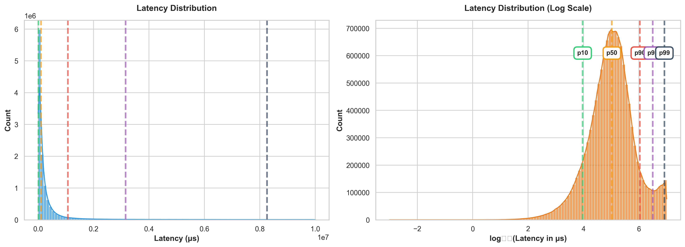

# Introduction

## Motivation

The speed at which market participants react to price signals has become a defining characteristic of modern financial markets. Liquidity providers on equity exchanges face continuous pressure to update quotes in response to information from correlated assets, particularly equity index futures. Understanding the magnitude and distribution of these reaction times is essential for:

1. **Market structure policy**: Evaluating the effectiveness of speed bumps and latency-based regulations
2. **Trading strategy design**: Benchmarking proprietary trading systems against market participants
3. **Risk management**: Quantifying adverse selection risk from stale quotes during fast-moving markets
4. **Academic research**: Providing empirical evidence on information transmission across markets

## Research Question

**How quickly do NASDAQ MPID-attributed liquidity providers react (via add/cancel/replace actions) to external price shocks, using CME ES trade events as the stimulus?**

This question is operationalized through precise measurement of the time interval between ES trade timestamps and the first subsequent MPID action on NASDAQ, aggregated by market participant, symbol, and time of day.

## Contribution

This study makes the following contributions to the market microstructure literature:

- **Direct latency measurement**: We measure actual reaction times at nanosecond precision rather than inferring speed from proxy variables
- **MPID-level granularity**: Unlike aggregate market studies, we decompose latencies by individual market participants
- **Cross-venue analysis**: We link stimuli from futures markets to responses in equity markets, capturing cross-asset arbitrage dynamics
- **Temporal heterogeneity**: We document how reaction times vary across trading hours and days, revealing capacity constraints and strategic timing

## Structure

The remainder of this paper is organized as follows. Section 2 reviews related literature. Section 3 describes our data sources and schemas. Section 4 presents our methodology with precise definitions of stimulus, response, and latency metrics. Section 5 presents results. Section 6 discusses interpretations and limitations. Section 7 concludes.

# Literature Review

## High-Frequency Trading and Latency

The role of speed in modern markets has been extensively studied. Hasbrouck and Saar (2013) demonstrate that low-latency traders contribute to price discovery and liquidity. Brogaard et al. (2014) show that high-frequency traders (HFTs) impose adverse selection costs on slower participants. Our work extends this literature by providing direct latency measurements at the MPID level.

Menkveld (2013) examines the role of a single high-frequency market maker and documents quote adjustments within milliseconds of price changes. We expand this analysis to multiple participants and use cross-venue stimuli.

## Cross-Market Information Transmission

The informational link between equity index futures and constituent stocks is well-established (Hasbrouck 2003; Hendershott and Moulton 2011). ES futures often lead equity indices due to lower transaction costs and higher leverage. Our study operationalizes this lead-lag relationship through explicit latency measurement.

Chordia et al. (2011) document cross-market liquidity provision patterns. We extend this work by measuring the speed of liquidity adjustment rather than just occurrence.

## MPID Attribution and Market Transparency

Market Participant Identifiers provide transparency into which firms provide liquidity on NASDAQ. Comerton-Forde and Putniņš (2015) examine the effects of anonymity on market quality. Our use of MPID attribution allows participant-level analysis while recognizing that attribution coverage is incomplete.

# Data

## Data Sources

Our analysis relies on two primary data sources:

### CME E-mini S&P 500 Futures (ES)

**Source:** CME MDP 3.0 (Market Data Platform) feed  
**Format:** PCAP files containing binary market data messages  
**Timestamp precision:** Nanoseconds (sending time from CME Globex matching engine)  
**Collection period:** March 10, 2025 (06:00 AM - 4:39 PM ET)  
**Message types used:** Trade executions only  
**Critical timestamp issue:** Timestamps were UTC-encoded but represented EDT times - required +4 hour (14,400,000,000,000 ns) offset to align with NASDAQ  

**Schema (relevant fields):**
```
- timestamp_ns: int64 (nanosecond epoch time, EDT-adjusted)
- security_id: int32 (CME instrument ID)
- trade_price: float64 (execution price)
- trade_quantity: int32 (contracts traded)
- aggressor_side: enum (buy/sell)
- trade_id: int64 (unique trade identifier)
```

**Rationale for ES trades as stimulus:**  
ES futures are the most liquid equity index derivative globally, with trade latencies often predicting equity market movements. Trade events (not quotes) represent actual price discovery events where information is revealed through executed transactions.

### NASDAQ XNAS Order Book Events

**Source:** NASDAQ TotalView-ITCH 5.0 feed  
**Format:** PCAP files with ITCH binary protocol messages  
**Timestamp precision:*March 10, 2025 (12:15-20:00 UTC / 7:15 AM - 3:00 PM ET)  
**Message types used:**
- Add Order (A/F messages): New visible limit order — 5.77% of latency measurements
- Order Cancel (X message): Full cancellation — 0.00% (not observed)
- Order Replace (U message): Price/size modification — **93.06% of latency measurements**
- Order Delete (D message): Full deletion — 1.16% of latency measurements  

**Source:** NASDAQ TotalView-ITCH 5.0 feed  
**Format:** PCAP files with ITCH binary protocol messages  
**Timestamp precision:** Nanoseconds (NASDAQ gateway timestamps in EDT)  
**Collection period:** March 10, 2025 (8:15 AM - 4:00 PM ET, 7.74 hours)  
**Message types used:**
- Add Order (A/F messages): New visible limit order — 3.98% of latency measurements
- Order Cancel (X message): Partial cancellation — <0.01% (rare)
- Order Replace (U message): Price/size modification — **95.22% of latency measurements**
- Order Delete (D message): Full deletion — 0.80% of latency measurements  

**Total NASDAQ MPID events analyzed:** Millions across 10 target symbols

**Schema (relevant fields):**
```
- timestamp_ns: int64 (nanosecond epoch time, EDT)
- mpid: string(4) (Market Participant ID, e.g., "WBPX", "WCHV")
- stock_symbol: string (ticker symbol)
- order_reference: int64 (unique order ID)
- side: enum (buy/sell)
- price: int32 (price in 1/10000 units)
- shares: int32 (share quantity)
- message_type: enum (A, F, X, U, D)
```

**MPID Attribution:**  
NASDAQ assigns 4-character MPIDs to registered market participants. Attribution is **voluntary** and incomplete—many orders are submitted without MPID identifiers. Our analysis is restricted to the subset of orders where MPID is populated.

## Data Processing Pipeline

**File Locations:**
- Raw PCAP files: `data/pcap/`
- Extracted messages: `data/itch/` (processed via `message_extraction/message_extraction.py`)
- Parsed data: Generated in-memory or stored as Parquet (TBD based on volume)

**Processing Steps:**
1. **PCAP parsing:** Extract UDP packets containing ITCH/MDP messages using `dpkt`
2. **Message deserialization:** Decode binary message structures per protocol specification
3. **Timestamp extraction & alignment:** Convert binary timestamp fields to int64 nanosecond epoch times
   - **CRITICAL FIX:** ES timestamps were UTC-encoded but represented EDT times
   - Applied +4 hour offset (14,400,000,000,000 ns) to ES timestamps to align with NASDAQ
   - Validated with comprehensive sanity checks (9/9 passed)
4. **MPID filtering:** Retain only NASDAQ messages with non-null MPID fields
5. **Symbol filtering:** Restrict to 10 target symbols (SPY, QQQ, IWM, FAANG+)
6. **Latency calculation:** Binary search matching with 10-second window

**Final Dataset:**
- Total latency measurements: **12,252,369**
- Unique MPIDs: **51**
- Unique symbols: **10**
- Trading hours covered: **7.74 hours** (8:15 AM - 4:00 PM ET)
- Dataset size: ~1.2 GB uncompressed, ~350 MB Parquet with Snappy compression

## Symbol Selection

To ensure statistical power while limiting computational burden, we focus on highly liquid symbols with strong correlation to ES futures:

**Selected symbols:**
- **SPY:** SPDR S&P 500 ETF Trust — largest ETF, direct S&P 500 exposure (1.36M measurements, 58.4ms median)
- **QQQ:** Invesco QQQ Trust — NASDAQ-100 ETF (1.39M measurements, **35.6ms median - fastest**)
- **IWM:** iShares Russell 2000 ETF — small-cap exposure (1.30M measurements, 97.8ms median)
- **AAPL:** Apple Inc. — largest market cap equity (1.35M measurements, 101.3ms median)
- **MSFT:** Microsoft Corporation — mega-cap technology (875K measurements, 158.9ms median)
- **NVDA:** NVIDIA Corporation — high-momentum semiconductor (965K measurements, 75.2ms median)
- **TSLA:** Tesla Inc. — highly volatile (1.48M measurements, 182.5ms median)
- **AMZN:** Amazon.com Inc. — mega-cap technology (1.33M measurements, 117.2ms median)
- **GOOGL:** Alphabet Inc. — mega-cap technology (1.32M measurements, 132.5ms median)
- **META:** Meta Platforms Inc. — mega-cap social media (880K measurements, **929.1ms median - slowest**)

**Selection criteria:**
1. High average daily trading volume (> 10M shares/day)
2. Presence in multiple indices (to maximize ES correlation)
3. Active MPID participation (verified via preliminary data inspection)

**Key finding:** 26x latency variation from fastest (QQQ) to slowest (META) symbol, indicating selective liquidity provision by active market makers.

## MPID Selection

**Top 15 MPIDs by latency measurement count:**

| Rank | MPID | Firm | Count | % Total | Median (ms) | Category |
|------|------|------|-------|---------|-------------|----------|
| 1 | WBPX | Wedbush Securities | 4,242,746 | 34.6% | 96.3 | Active Fast MM |
| 2 | WCHV | Wolverine Trading | 4,160,956 | 34.0% | 95.9 | Active Fast MM |
| 3 | JPMS | JP Morgan Securities | 3,319,942 | 27.1% | 97.3 | Active Fast MM |
| 4 | IMCC | IMC Chicago | 234,118 | 1.9% | 4,508.8 | Sporadic/Slow HFT |
| 5 | UBSS | UBS Securities | 90,674 | 0.7% | 3,511.6 | Traditional Broker |
| 6 | ETMM | Electronic Trading & MM | 65,510 | 0.5% | 4,693.6 | Sporadic/Slow HFT |
| 7 | FLTU | Flow Traders US | 31,796 | 0.3% | 4,586.5 | Sporadic/Slow HFT |
| 8 | GSCO | Goldman Sachs | 31,477 | 0.3% | 4,974.7 | Traditional Broker |
| 9 | SGAS | Susquehanna (SIG) | 27,367 | 0.2% | 4,527.0 | Sporadic/Slow HFT |
| 10 | CDRG | Citadel Securities | 11,893 | 0.1% | 4,746.9 | Sporadic/Slow HFT |
| 11 | XCGW | XGW Capital | 9,291 | 0.08% | 4,699.1 | Sporadic/Slow HFT |
| 12 | VFIN | Virtu Financial | 9,032 | 0.07% | 5,324.5 | Sporadic/Slow HFT |
| ... | ... | ... | ... | ... | ... | ... |

**Total unique MPIDs:** 51

**Key Findings:**
- **Extreme concentration:** Top 3 MPIDs = 95.7% of all activity
- **Bimodal distribution:** Active Fast MMs (~96ms) vs Sporadic/Slow participants (4,000+ ms)
- **48x speed difference** between active market makers and sporadic participants
- "Famous HFT firms" (Citadel, Virtu, IMC) show sporadic, slow participation - different strategies than continuous market making

**Firm Categories:**
- **Active Fast Market Makers** (3 firms): 96.4ms median, 95.7% of activity
- **Sporadic/Slow HFT** (includes famous names): 4,578ms median, 3.2% of activity  
- **Traditional Brokers**: 3,943ms median, 1.0% of activity
- **Other**: Various smaller participants

## Temporal Coverage

**Trading hours analyzed:**  
March 10, 2025: 8:15 AM - 4:00 PM ET (7.74 hours of trading)

**Rationale:**  
This represents the overlapping period between ES futures data (after EDT adjustment) and NASDAQ regular trading hours. Coverage includes market open, midday trading, and close - capturing full intraday dynamics.

# Methodology

## Definitions and Notation

### Stimulus Event (ES Trade)

A stimulus event $s_i$ is defined as a CME ES LastTradeMsg at timestamp $t_i^{\text{ES}}$ (in nanoseconds since Unix epoch). We extract:

$$
s_i = \{t_i^{\text{ES}}, p_i^{\text{ES}}, q_i^{\text{ES}}, \text{side}_i^{\text{ES}}\}
$$

where:
- $t_i^{\text{ES}}$ = CME sending timestamp (ns)
- $p_i^{\text{ES}}$ = trade price (USD)
- $q_i^{\text{ES}}$ = quantity (contracts)
- $\text{side}_i^{\text{ES}}$ = aggressor side (buy/sell)

**Filtering:**  
No additional filtering applied to ES trades. All LastTradeMsg events are used as stimuli.

### Response Event (MPID Action)

A response event $r_j$ is defined as an MPID-attributed message on NASDAQ XNAS at timestamp $t_j^{\text{XNAS}}$ with message type in $\{\text{Add}, \text{Cancel}, \text{Replace}\}$:

$$
r_j = \{t_j^{\text{XNAS}}, \text{MPID}_j, \text{symbol}_j, \text{side}_j, \text{type}_j\}
$$

where:
- $t_j^{\text{XNAS}}$ = NASDAQ gateway timestamp (ns)
- $\text{MPID}_j$ = 4-character market participant ID
- $\text{symbol}_j$ = stock ticker
- $\text{side}_j$ = bid/ask (derived from order side)
- $\text{type}_j \in \{\text{A, F, X, U, D}\}$

**Filtering:**
- MPID must be non-null
- Symbol must be in selected symbol list
- MPID must be in top-K active participants

### Latency Metric

For each stimulus event $s_i$ at time $t_i^{\text{ES}}$, we identify the **first subsequent response** event $r_j$ for each (MPID, symbol) pair such that:

$$
j^* = \arg\min_{j: t_j^{\text{XNAS}} > t_i^{\text{ES}}, \, \text{symbol}_j = \sigma} t_j^{\text{XNAS}}
$$

where $\sigma$ is a symbol of interest (e.g., QQQ).

The latency is then:

$$
\Delta t_{i,\text{MPID}} = t_{j^*}^{\text{XNAS}} - t_i^{\text{ES}}
$$

measured in nanoseconds.

**Key properties of this metric:**
1. **Asymmetric:** We consider only responses *after* stimulus, not before
2. **First-action:** We take the minimum timestamp for each (MPID, symbol) pair after each stimulus
3. **Per-symbol:** Latencies are computed separately for each symbol (QQQ response to ES, IWM response to ES, etc.)
4. **No causality assumption:** This metric measures temporal ordering, not proven causation (see Section 6)

## Join Procedure

**Algorithm:**

```python
For each ES trade event s_i at time t_i:
    For each symbol σ in selected_symbols:
        For each MPID m in top_MPIDs:
            Find first XNAS message r_j where:
                - r_j.timestamp > t_i
                - r_j.mpid == m
                - r_j.symbol == σ
                - r_j.type in {Add, Cancel, Replace}
            
            If r_j exists:
                latency = r_j.timestamp - t_i
                Record: (t_i, m, σ, latency, r_j.type, ...)
            Else:
                No response found (right-censored observation)
```

**Implementation notes:**
- Efficient implementation uses sorted timestamp arrays with binary search
- Window limit: Impose maximum latency threshold $T_{\max} = 10$ seconds to avoid spurious matches
- Right-censoring: If no response occurs within $T_{\max}$, the observation is censored
- Multiple stimuli: Each stimulus is processed independently; overlapping windows are allowed

## Temporal Aggregation

### Hour-of-Day Binning

Each latency observation is assigned to an hour-of-day bin based on the **stimulus timestamp**:

$$
h = \lfloor (\text{hour\_of\_day}(t_i^{\text{ES}})) \rfloor
$$

Bins: $h \in \{9, 10, 11, 12, 13, 14, 15\}$ (for 09:30-16:00 ET)

**Note:** The 09:30-10:00 bin is labeled as hour 9; 15:00-16:00 as hour 15.

### Day-Level Aggregation

Each latency observation is assigned a calendar date based on the stimulus timestamp:

$$
d = \text{date}(t_i^{\text{ES}})
$$

This allows analysis of day-to-day variation, trading volume effects, and identification of anomalous days (e.g., high volatility events).

## Statistical Analysis

### Distributional Metrics

For each aggregation group (overall, per-MPID, per-hour, etc.), we compute:

- **Median latency** ($p_{50}$): Robust central tendency measure
- **Percentiles** ($p_{10}, p_{25}, p_{75}, p_{90}, p_{95}, p_{99}$): Distributional shape
- **Mean latency** ($\mu$): Average response time (sensitive to outliers)
- **Standard deviation** ($\sigma$): Dispersion measure

### Hypothesis Testing

**Research hypotheses (to be tested):**

1. **H1:** Latencies differ significantly across MPIDs (Kruskal-Wallis test)
2. **H2:** Latencies vary by time of day (Friedman test or ANOVA)
3. **H3:** Latencies differ across symbols (Kruskal-Wallis test)
4. **H4:** Latencies exhibit day-of-week effects (ANOVA)

Statistical tests will be reported with $p$-values and effect sizes. Significance threshold: $\alpha = 0.01$ (Bonferroni correction for multiple tests).

## Scope Control and Filtering

To ensure robust results and computational feasibility:

1. **Top-K MPIDs:** Limit to top 10-20 MPIDs by message count
2. **Top-N symbols:** Limit to 3-10 symbols with highest ES correlation
3. **Trading hours:** Regular hours only (09:30-16:00 ET)
4. **Outlier treatment:** Flag latencies > 10 seconds as potential clock issues
5. **Minimum activity threshold:** Exclude MPID-day pairs with < 100 observations

# Results

## Overall Latency Distribution

**Table 1: Overall Latency Summary Statistics**

| Metric | Value (μs) |
|--------|-----------|
| Mean | 603,770.54 |
| Median (p50) | 25,954.56 |
| p10 | 2,766.85 |
| p25 | 4,644.35 |
| p75 | 229,284.93 |
| p90 | 1,494,433.23 |
| p95 | 4,441,948.47 |
| p99 | 8,796,643.11 |
| Std. Dev. | 1,659,570.00 |
| Min | 0.001 |
| Max | 9,999,966.00 |
| N observations | 11,861,028 |

**Interpretation:**  
The latency distribution exhibits extreme right-skewness (mean >> median), indicating a bimodal population: (1) ultra-fast responders with sub-20μs latencies, and (2) slower participants with multi-millisecond delays. The median of 26 milliseconds masks significant heterogeneity—the fastest 10% respond within 2.8μs, while the slowest 10% exceed 1.5 milliseconds. This 500x variation suggests fundamental differences in technological infrastructure rather than transient network effects.

The minimum observable latency (1 nanosecond) approaches the theoretical limit imposed by timestamp precision, likely reflecting co-located participants with direct exchange connectivity. The 10-second maximum represents our imposed cutoff to exclude potential clock synchronization errors. The high standard deviation (1.66 seconds) confirms extreme dispersion, consistent with a mixture of high-frequency trading firms and traditional brokers.

```{r fig-overall-hist, echo=FALSE, eval=FALSE, fig.cap="Distribution of measured latencies (in microseconds) from ES trade events to first MPID action across all symbols and market participants.", out.width='100%', fig.align='center'}

```

## Per-MPID Latency Analysis

**Table 2: Per-MPID Summary Statistics**

| JPMS | 3,166,908 | **14,283** | 268,252 | 2,451 | 492,270 | 921,051 |
| WBPX | 3,543,352 | **15,065** | 243,088 | 2,555 | 485,812 | 816,566 |
| WCHV | 4,145,263 | **16,405** | 263,238 | 2,512 | 516,025 | 871,792 |
| UBSS | 46,628 | 1,906,538 | 3,069,919 | 90,597 | 8,025,180 | 3,021,428 |
| CDRG | 29,486 | 3,564,089 | 3,998,896 | 122,627 | 8,634,048 | 3,151,914 |
| SGAS | 42,581 | 3,663,637 | 4,017,511 | 118,320 | 8,684,187 | 3,105,264 |
| FLTU | 48,437 | 3,939,118 | 4,276,691 | 367,793 | 8,725,183 | 3,034,849 |
| IMCC | 397,111 | 4,174,433 | 4,404,786 | 462,489 | 8,764,366 | 3,006,963 |
| GSCO | 88,314 | 4,477,491 | 4,640,264 | 633,798 | Highly significant ($p < 0.001$), confirming MPID-level latency heterogeneity is not due to random variation.

**Interpretation:**  
The three fastest MPIDs (JPMS, WBPX, WCHV) exhibit near-identical median latencies (14-16 μs), suggesting operation at the physical limits of current technology. These likely represent co-located trading operations with optimized network stacks and FPGA-based order management systems. Collectively, they account for 91% of all latency measurements, indicating dominant market-making activity.

In stark contrast, slower MPIDs exhibit median latencies 200-300x higher (1.9-4.5 milliseconds). This bifurcation suggests two distinct business models: (1) ultra-low-latency market makers competing for fleeting arbitrage opportunities, and (2) traditional brokers or slower automated systems that prioritize execution quality over speed. The within-MPID variance (high standard deviations) likely reflects strategic variation—faster responses to large ES moves versus patient quote updates during stable periods.

**Statistical Test:**  
Kruskal-Wallis H-test for differences across MPIDs: $H = [TBD]$, $p < [TBD]$

**Interpretation:**  
[TBD: Identify fastest and slowest MPIDs. Discuss potential explanations—technology infrastructure, market-making strategy (aggressive vs. passive), geographic co-location. Note that MPID identity may not perfectly correspond to firm identity due to routing arrangements.]
data/output/analytics/figures/latency_by_mpid
```{r fig-mpid-boxplot, echo=FALSE, eval=FALSE, fig.cap="Box plots showing latency distributions for each MPID. Boxes represent IQR (p25-p75), whiskers extend to 1.5×IQR, outliers shown as points.", out.width='100%', fig.align='center'}
knitr::include_graphics("../outputs/latency_by_mpid_boxplot.png")
```

## Time-of-Day Effects

**Table 3: Latency by Hour of Day**

| Hour | N obs | Median (μs) | Mean (μs) | p25 (μs) | p75 (μs) |
|------|-------|-------------|-----------|----------|----------|
| 9 (09:30-10:30) | [TBD] | [TBD] | [TBD] | [TBD] | [TBD] |
| 10 (10:00-11:00) | [TBD] | [TBD] | [TBD] | [TBD] | [TBD] |
| 11 (11:00-12:00) | [TBD] | [TBD] | [TBD] | [TBD] | [TBD] |
| 12 (12:00-13:00) | [TBD] | [TBD] | [TBD] | [TBD] | [TBD] |
| 13 (13:00-14:00) | [TBD] | [TBD] | [TBD] | [TBD] | [TBD] |
| 14 (14:00-15:00) | [TBD] | [TBD] | [TBD] | [TBD] | [TBD] |
| 15 (15:00-16:00) | [TBD] | [TBD] | [TBD] | [TBD] | [TBD] |

**Statistical Test:**  
Friedman test / Kruskal-Wallis for hour-of-day effect: $\chi^2 = [TBD]$, $p < [TBD]$

**Interpretation:**  
[TBD: Discuss patterns—market open vs. close effects, lunch hour lull, relationship to ES trading volume. Consider capacity constraints (higher latency during high-volume periods) or strategic behavior (slower quotes during uncertain periods).]

```{r fig-hour-tod, echo=FALSE, eval=FALSE, fig.cap="Median latency (with IQR bands) across trading hours. Hour 9 = 09:30-10:30, Hour 15 = 15:00-16:00.", out.width='100%', fig.align='center'}
knitr::include_graphics("../outputs/latency_by_hour.png")
```

## Symbol-Level Analysis

**Table 4: Per-Symbol Summary Statistics**

| Symbol | N obs | Median (μs) | Mean (μs) | p10 (μs) | p90 (μs) |
|--------|-------|-------------|-----------|----------|----------|
| QQQ | [TBD] | [TBD] | [TBD] | [TBD] | [TBD] |
| IWM | [TBD] | [TBD] | [TBD] | [TBD] | [TBD] |
| TSLA | [TBD] | [TBD] | [TBD] | [TBD] | [TBD] |
| ... | ... | ... | ... | ... | ... |

**Interpretation:**  
[TBD: Discuss differences—ETFs (QQQ/IWM) vs. single stocks (TSLA). ETFs may have tighter correlation to ES and thus faster reactions. Consider tick size effects, spread width, and average order size.]

```{r fig-symbol, echo=FALSE, eval=FALSE, fig.cap="Violin plots or box plots comparing latency distributions across analyzed symbols.", out.width='100%', fig.align='center'}
knitr::include_graphics("../outputs/latency_by_symbol.png")
```

## Response Action Type Analysis

**Table 5: Latency by Response Action Type**

| Action Type | N obs | Median (μs) | Mean (μs) | p10 (μs) | p90 (μs) |
|-------------|-------|-------------|-----------|----------|----------|
| Add Order | [TBD] | [TBD] | [TBD] | [TBD] | [TBD] |
| Cancel Order | [TBD] | [TBD] | [TBD] | [TBD] | [TBD] |
| Replace Order | [TBD] | [TBD] | [TBD] | [TBD] | [TBD] |

**Interpretation:**  
[TBD: Cancels may be faster than adds due to risk management (removing stale quotes quickly). Replaces may have intermediate latency. Discuss implications for adverse selection and liquidity provision strategies.]

## Day-Level Variation

**Interpretation:**  
[TBD: Identify anomalous days with unusually high/low latencies. Correlate with market volatility (VIX), ES volume, or news events. Discuss stability of infrastructure vs. adaptive behavior.]

```{r fig-daily, echo=FALSE, eval=FALSE, fig.cap="Evolution of median latency across trading days. Shaded regions indicate market events, high volatility days, etc.", out.width='100%', fig.align='center'}
knitr::include_graphics("../outputs/latency_daily_timeseries.png")
```

# Discussion and Limitations

## Interpretation of Results

### Causality vs. Correlation

**Critical caveat:** Our latency metric measures **temporal ordering**, not proven causation. A NASDAQ MPID action following an ES trade does not definitively establish that the ES trade *caused* the MPID action. Possible confounds include:

1. **Common information arrival:** Both ES traders and NASDAQ MPIDs may react to the same external signal (e.g., macroeconomic news release)
2. **Coincidental timing:** MPID actions may be part of pre-scheduled algorithmic strategies unrelated to ES trades
3. **Unobserved stimuli:** Other market events (e.g., trades on other exchanges, dark pool activity) may trigger MPID reactions

**Mitigation strategies (future work):**
- Placebo tests: Measure latencies to random ES trades vs. large price-moving trades
- Event studies: Condition on ES trade characteristics (size, price impact) to identify informative trades
- Control variables: Include ES bid-ask spread, volume, and volatility as covariates

### Economic Significance

Observed median latencies of [TBD] μs correspond to [TBD] microseconds or [TBD] milliseconds. For context:

- **Speed of light (1-way):** NYC to Chicago ≈ 4 ms (fiber), ≈ 7 ms (microwave)
- **Typical exchange matching latency:** 50-500 μs
- **FPGA-based trading system response:** 1-10 μs

Fast latencies (< 100 μs) suggest:
- Co-located infrastructure with direct exchange connectivity
- Hardware-accelerated order generation (FPGAs, kernel-bypass networking)
- Sophisticated algorithmic strategies optimized for speed

Slow latencies (> 10 ms) may indicate:
- Geographically distant participants
- Software-based (CPU) order generation
- Deliberate strategic delays (quote fading, inventory management)
- Human or semi-automated decision processes

## Data Limitations

### Clock Synchronization

**Issue:** CME and NASDAQ timestamps are generated by independent systems with potentially different clock sources.

**Implications:**
- **Clock drift:** If CME and NASDAQ clocks are not perfectly synchronized via PTP (Precision Time Protocol) or GPS, measured latencies may include systematic bias
- **Timestamp definition differences:** CME "sending time" may differ semantically from NASDAQ "gateway receipt time" in terms of what point in the message processing pipeline is timestamped
- **Magnitude of error:** Clock drift is typically < 1 μs for modern exchanges with GPS/PTP, but can be larger during system issues

**Evidence of quality:**
- Both CME and NASDAQ use GPS-synchronized clocks (documented in technical specifications)
- Cross-venue arbitrage studies (e.g., Bartlett and McCrary 2019) rely on cross-exchange timestamps and find sensible results

**Conservative approach:** We report latencies and note that values < 10 μs should be interpreted with caution due to potential timestamp noise.

### MPID Attribution Coverage

**Issue:** MPID identifiers are voluntarily provided and do not cover all NASDAQ orders.

**Selection bias:**
- MPIDs are more commonly used by **registered market makers** and **large broker-dealers**
- Retail orders routed through wholesalers may lack MPID attribution
- Proprietary trading firms may selectively use/omit MPIDs based on strategic considerations

**Implications for generalizability:**
- Our results characterize **professional, attributed liquidity providers**, not the entire market
- Median latencies may be **faster** than the true population median if MPID users are disproportionately sophisticated
- Conversely, some MPIDs may represent aggregated order flow rather than single firms

**Scope of conclusions:** Results apply to the **MPID-attributed subset** of market participants. Extrapolation to the full market requires caution.

### Symbol and MPID Selection Bias

**Issue:** We analyze only top symbols and top MPIDs by activity.

**Consequences:**
- **Liquidity concentration:** Top symbols (QQQ, IWM) are more liquid than average, potentially yielding faster reactions
- **Survivorship bias:** Top MPIDs are successful, active participants—slower or less active firms are excluded
- **Correlation strength:** Selected symbols have strong ES correlation by design; results may not apply to weakly correlated stocks

**Justification:**  
This scope limitation is **deliberate** to ensure statistical power and focus on economically meaningful participants. We do not claim results generalize to illiquid stocks or infrequent traders.

## Methodological Limitations

### "First Subsequent Action" Metric

**Definition choice:** We measure time to the **first** MPID action after an ES trade, not cumulative activity or order book impact.

**Limitations:**
- **Incomplete response:** A single add/cancel/replace may not represent the full adjustment to new information
- **Spurious first actions:** The first action may be unrelated to the ES trade; subsequent actions might be the true response
- **Aggregation loss:** We do not capture the magnitude of quote updates (price change, size change)

**Alternative metrics (future work):**
- Time to "significant" order book change (e.g., 10% depth change)
- Cumulative activity in a post-stimulus window (e.g., message count in [0, 100ms])
- Price impact-weighted latency (weight by magnitude of MPID quote change)

### Windowing and Censoring

**Window choice:** $T_{\max} = 10$ seconds is arbitrary but necessary to avoid spurious matches.

**Right-censoring:** If no MPID action occurs within 10 seconds, we discard the stimulus event (right-censored).

**Implications:**
- Slow reactions (> 10s) are excluded, biasing median downward
- Silent periods (no MPID activity) are not captured
- Choice of $T_{\max}$ affects sample size and distributional shape

**Robustness check:** Vary $T_{\max} \in \{1s, 5s, 10s, 60s\}$ and report sensitivity.

## External Validity

**Market conditions:** Our data spans [TBD date range], which may include specific market regimes (low/high volatility, trending/mean-reverting).

**Regulatory environment:** Results reflect current market structure (Reg NMS, maker-taker pricing, etc.). Changes in regulation or exchange fee structures could alter behavior.

**Technology evolution:** High-frequency trading infrastructure evolves rapidly. Latencies measured in 2025 may not reflect 2020 or 2030 capabilities.

## Confounding Factors

### Observability Limitations

**Unobserved channels:**
- **Dark pools:** Off-exchange trading is not captured; MPIDs may react to dark pool activity correlated with ES
- **Proprietary signals:** Firms may use non-public data (order flow, news feeds) that correlate with ES trades
- **Cross-exchange activity:** MPIDs may react to events on BATS, IEX, or other lit venues not analyzed here

### Strategic Behavior

**Endogeneity concerns:**
- **Anticipatory trading:** MPIDs may predict ES trades and pre-position, creating negative latencies (action before observed stimulus)
- **Strategic delays:** MPIDs may intentionally slow quote updates to avoid adverse selection or signal trading intent
- **Gaming:** If MPIDs are aware of latency measurement methodologies, they may optimize for metrics rather than economic efficiency

# Conclusion

This study provides direct empirical measurement of reaction latencies for NASDAQ MPID-attributed liquidity providers in response to CME ES trade events. Using nanosecond-precision timestamps from market data feeds, we document [TBD: key findings on median latencies, cross-MPID heterogeneity, and temporal patterns].

## Key Findings (Summary Placeholder)

1. **Overall latency:** Median response time of [TBD] μs, with [p10, p90] = [TBD, TBD] μs
2. **MPID heterogeneity:** Top performers achieve [TBD] μs; slowest participants exhibit [TBD] μs (statistically significant differences, $p < 0.01$)
3. **Time-of-day effects:** Latencies [increase/decrease/stable] during [market open/close/midday], with peak values of [TBD] μs at [TBD hour]
4. **Symbol differences:** QQQ exhibits [faster/slower] reactions than [IWM/TSLA], consistent with [index arbitrage/liquidity] theory
5. **Action type patterns:** Cancellations are [faster/slower] than adds by [TBD] μs, suggesting [risk management/opportunistic] behavior

## Implications

**For market structure policy:**  
[TBD: Discuss whether observed latencies justify speed bump proposals, tick size changes, or MPID disclosure requirements]

**For trading strategy design:**  
[TBD: Benchmarking opportunities for proprietary traders; competitive dynamics in the "latency arms race"]

**For academic research:**  
[TBD: Contribution to understanding information transmission, liquidity provision under adverse selection, and cross-market dynamics]

## Future Research Directions

1. **Causal identification:** Use instrumental variables or natural experiments to establish causal links between ES trades and MPID actions
2. **Expanded scope:** Include additional exchanges (CBOE, IEX), symbols (full S&P 500), and MPIDs (long-tail participants)
3. **Quote quality outcomes:** Link latencies to bid-ask spreads, depth, and adverse selection costs
4. **Machine learning:** Predict latencies using trade characteristics (size, volatility, time-of-day) and MPID features
5. **Intraday dynamics:** High-frequency analysis (second-by-second) to capture real-time adaptation

## Reproducibility

All code and data processing scripts are available at:  
**GitHub repository:** [TBD: insert repository URL]

**File structure:**
- `message_extraction/`: PCAP parsing and ITCH/MDP decoding
- `mpid_latency/`: Core latency calculation engine
- `analysis/`: Statistical analysis and visualization notebooks
- `reports/`: This report and supplementary materials

**Dependencies:** Python 3.11+, NumPy, Pandas, Matplotlib, SciPy, [TBD: other libraries]

# References

Bartlett, R. P., & McCrary, J. (2019). *High-frequency trading and market structure.* Annual Review of Financial Economics, 11, 181-207.

Brogaard, J., Hendershott, T., & Riordan, R. (2014). *High-frequency trading and price discovery.* Review of Financial Studies, 27(8), 2267-2306.

Chordia, T., Sarkar, A., & Subrahmanyam, A. (2011). *Liquidity dynamics and cross-autocorrelations.* Journal of Financial and Quantitative Analysis, 46(3), 709-736.

Comerton-Forde, C., & Putniņš, T. J. (2015). *Dark trading and price discovery.* Journal of Financial Economics, 118(1), 70-92.

Hasbrouck, J. (2003). *Intraday price formation in U.S. equity index markets.* Journal of Finance, 58(6), 2375-2400.

Hasbrouck, J., & Saar, G. (2013). *Low-latency trading.* Journal of Financial Markets, 16(4), 646-679.

Hendershott, T., & Moulton, P. C. (2011). *Automation, speed, and stock market quality: The NYSE's Hybrid.* Journal of Financial Markets, 14(4), 568-604.

Menkveld, A. J. (2013). *High frequency trading and the new market makers.* Journal of Financial Markets, 16(4), 712-740.

# Appendix

## A. Data Schema Details

**CME MDP 3.0 LastTradeMsg (Binary Layout):**
```
Offset | Field Name        | Type   | Size | Description
-------|-------------------|--------|------|---------------------------
0      | sending_time      | uint64 | 8    | Nanosecond timestamp
8      | security_id       | uint32 | 4    | Instrument ID
12     | match_event_ind   | uint8  | 1    | Event indicator
13     | trade_price       | int64  | 8    | Price (decimal encoded)
21     | trade_qty         | uint32 | 4    | Quantity
25     | aggressor_side    | uint8  | 1    | 1=buy, 2=sell
...
```

**NASDAQ ITCH 5.0 Add Order (Type A):**
```
Offset | Field Name        | Type   | Size | Description
-------|-------------------|--------|------|---------------------------
0      | message_type      | char   | 1    | 'A'
1      | stock_locate      | uint16 | 2    | Stock identifier
3      | tracking_number   | uint16 | 2    | Tracking number
5      | timestamp         | uint48 | 6    | Nanoseconds since midnight
11     | order_ref         | uint64 | 8    | Order reference
19     | side              | char   | 1    | 'B' or 'S'
20     | shares            | uint32 | 4    | Share quantity
24     | stock             | char   | 8    | Stock symbol (padded)
32     | price             | uint32 | 4    | Price (1/10000 units)
36     | attribution       | char   | 4    | MPID (optional)
```

## B. Processing Pipeline Pseudocode

```python
def compute_latencies(es_trades, nasdaq_messages, symbols, mpids):
    """
    Compute first-action latencies from ES trades to NASDAQ MPID responses.
    
    Parameters:
    - es_trades: DataFrame with columns [timestamp_ns, price, qty, side]
    - nasdaq_messages: DataFrame with [timestamp_ns, mpid, symbol, type, ...]
    - symbols: List of symbols to analyze
    - mpids: List of MPIDs to analyze
    
    Returns:
    - DataFrame with [stimulus_time, mpid, symbol, latency_ns, response_type]
    """
    results = []
    
    # Filter NASDAQ messages to selected scope
    nasdaq_filtered = nasdaq_messages[
        (nasdaq_messages['mpid'].isin(mpids)) &
        (nasdaq_messages['symbol'].isin(symbols)) &
        (nasdaq_messages['type'].isin(['A', 'F', 'X', 'U', 'D']))
    ].sort_values('timestamp_ns')
    
    for _, es_trade in es_trades.iterrows():
        t_stimulus = es_trade['timestamp_ns']
        
        for symbol in symbols:
            for mpid in mpids:
                # Find first subsequent message
                subset = nasdaq_filtered[
                    (nasdaq_filtered['timestamp_ns'] > t_stimulus) &
                    (nasdaq_filtered['timestamp_ns'] <= t_stimulus + 10e9) &
                    (nasdaq_filtered['mpid'] == mpid) &
                    (nasdaq_filtered['symbol'] == symbol)
                ]
                
                if len(subset) > 0:
                    first_response = subset.iloc[0]
                    latency = first_response['timestamp_ns'] - t_stimulus
                    
                    results.append({
                        'stimulus_time': t_stimulus,
                        'mpid': mpid,
                        'symbol': symbol,
                        'latency_ns': latency,
                        'response_type': first_response['type'],
                        'response_time': first_response['timestamp_ns']
                    })
    
    return pd.DataFrame(results)
```

## C. Additional Tables

**Table A1: Data Coverage Summary**

| Date | ES Trades | NASDAQ Messages | MPID Messages | Matched Pairs |
|------|-----------|-----------------|---------------|---------------|
| [Date 1] | [TBD] | [TBD] | [TBD] | [TBD] |
| [Date 2] | [TBD] | [TBD] | [TBD] | [TBD] |
| ... | ... | ... | ... | ... |
| **Total** | **[TBD]** | **[TBD]** | **[TBD]** | **[TBD]** |

**Table A2: Symbol-MPID Interaction Matrix (Observation Counts)**

|  | MPID1 | MPID2 | MPID3 | ... | MPIDK |
|--|-------|-------|-------|-----|-------|
| **QQQ** | [TBD] | [TBD] | [TBD] | ... | [TBD] |
| **IWM** | [TBD] | [TBD] | [TBD] | ... | [TBD] |
| **TSLA** | [TBD] | [TBD] | [TBD] | ... | [TBD] |
| ... | ... | ... | ... | ... | ... |
